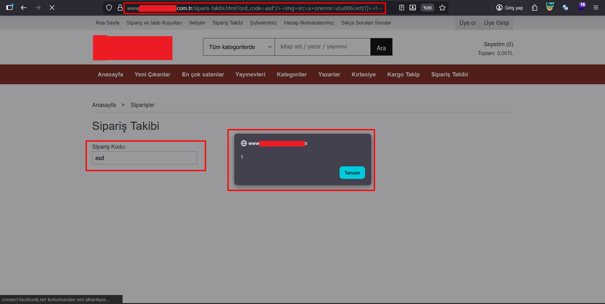
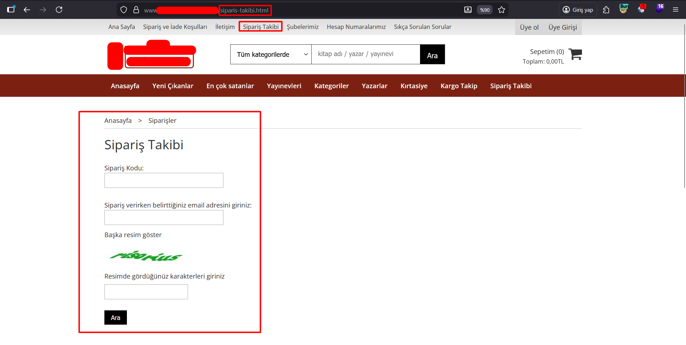
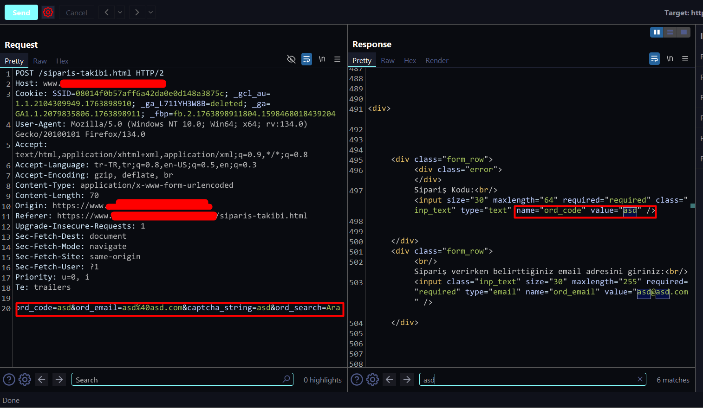
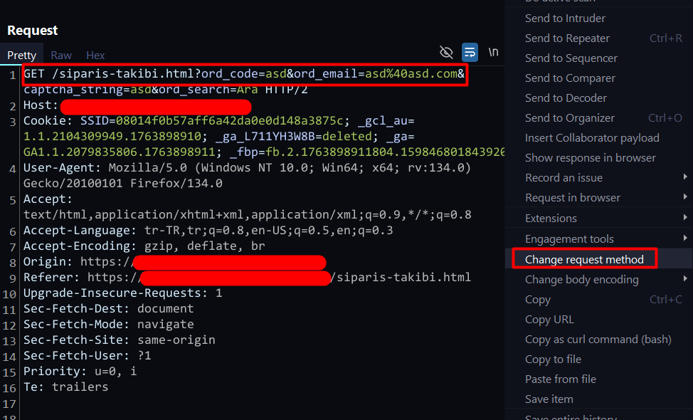
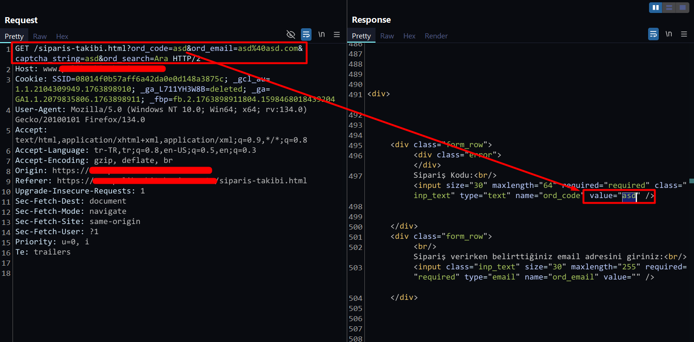
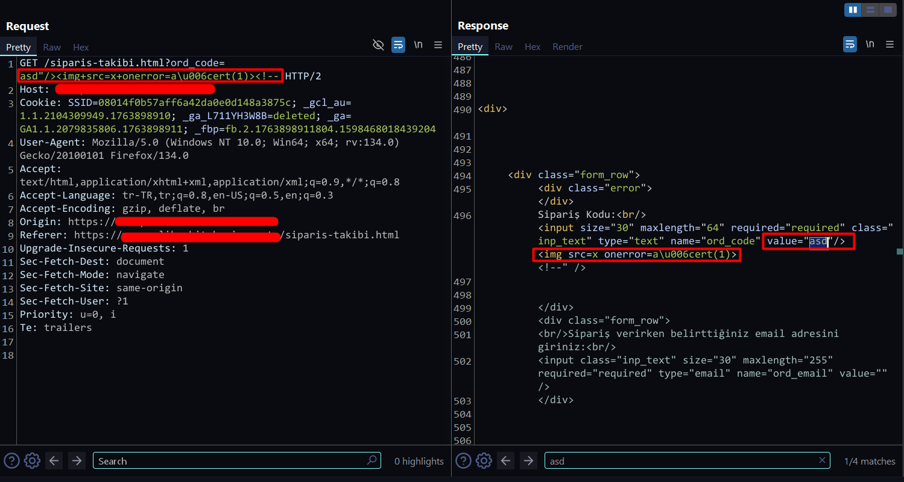

# Basic POC

Endpoint: "/siparis-takibi.html"
Parameter: "ord_code"
Payload: "asd%22/%3E%3Cimg+src=x+onerror=a%5Cu006cert(1)%3E%3C!--"

# How The Vulnerable Parameter Was Detected

1- Go to the "Order Tracking" page.

2- When the required fields for order tracking are filled with random values and submitted, the request shown in the screenshot appears in Burp Suite.
Upon inspecting the request, it can be seen that the received values are used inside the HTML.

3- Right‑click the request and convert it to run with the GET method.

4- When the request is sent, it can be seen that the "ord_code" parameter is used inside the HTML._

5- After several attempts, the XSS vulnerability is identified and successfully triggered.

